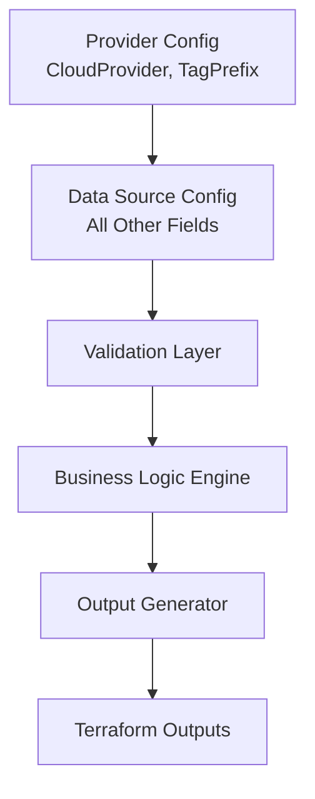
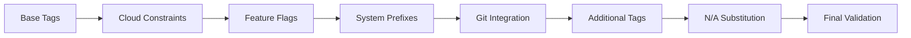

# Context Terraform Provider - Design Document

## Executive Summary

The Context Terraform Provider is designed to replace the `kbrockhoff/terraform-external-context` module with a native Terraform provider implementation. This provider generates standardized naming conventions and cloud-provider-specific tags for infrastructure resources, ensuring consistent resource management across multiple cloud platforms.

## Architecture Overview

### Component Structure

```
terraform-provider-context/
├── internal/
│   ├── provider/          # Provider implementation
│   │   ├── provider.go    # Main provider configuration
│   │   └── provider_test.go
│   ├── datasource/        # Data source implementations
│   │   ├── context.go     # Context data source
│   │   └── context_test.go
│   ├── core/              # Core business logic
│   │   ├── naming.go      # Name prefix generation
│   │   ├── tags.go        # Tag processing logic
│   │   ├── cloud.go       # Cloud provider constraints
│   │   ├── git.go         # Git repository integration
│   │   └── validation.go  # Input validation
│   └── models/            # Data models
│       ├── config.go      # Configuration models
│       └── outputs.go     # Output models
├── examples/              # Usage examples
├── docs/                  # Documentation
└── tests/                 # Integration tests
```

### Key Design Principles

1. **Stateless Operation**: All outputs are computed deterministically from inputs
2. **Cloud Provider Abstraction**: Single interface supporting multiple cloud providers
3. **Backward Compatibility**: Maintains exact compatibility with existing module
4. **Extensibility**: Easy to add new cloud providers or tag categories
5. **Performance**: Minimal external calls with intelligent caching

## Core Components

### 1. Provider Configuration

The provider serves as a minimal configuration container for global settings that can be referenced by data sources. It only contains cloud-specific configuration that affects tag formatting rules.

```go
type ProviderConfig struct {
    // Core configuration only
    CloudProvider string  // Cloud provider identifier: dc, aws, az, gcp, oci, ibm, do, vul, ali, cv
    TagPrefix     string  // Prefix for all generated tags (default: "bc-")
}
```

### 2. Context Data Source

The context data source is the primary interface for generating outputs. It contains all configuration fields and references the provider for cloud-specific formatting rules.

```go
type ContextDataSource struct {
    // Provider reference for cloud-specific rules
    providerConfig *ProviderConfig
    
    // All configuration fields
    config *DataSourceConfig
}

type DataSourceConfig struct {
    // Naming configuration
    Namespace      string
    Name           string
    Environment    string
    EnvironmentName string
    EnvironmentType string
    
    // Resource management
    Enabled        bool
    Availability   string
    ManagedBy      string
    DeletionDate   string
    
    // Integration configurations
    PMPlatform      string
    PMProjectCode   string
    ITSMPlatform    string
    ITSMSystemID    string
    ITSMComponentID string
    ITSMInstanceID  string
    
    // Ownership and billing
    CostCenter     string
    ProductOwners  []string
    CodeOwners     []string
    DataOwners     []string
    
    // Data classification
    Sensitivity     string
    DataRegs        []string
    SecurityReview  string
    PrivacyReview   string
    
    // Feature toggles
    SourceRepoTagsEnabled     bool
    SystemPrefixesEnabled     bool
    NotApplicableEnabled      bool
    OwnerTagsEnabled          bool
    
    // Additional tags
    AdditionalTags     map[string]string
    AdditionalDataTags map[string]string
}

type ContextOutputs struct {
    // Primary outputs
    NamePrefix string
    Tags       map[string]string
    DataTags   map[string]string
    
    // Alternative formats
    TagsAsListOfMaps           []map[string]string
    TagsAsKVPList              []string
    TagsAsCommaSeparatedString string
    DataTagsAsListOfMaps       []map[string]string
    DataTagsAsKVPList          []string
    DataTagsAsCommaSeparatedString string
}
```

### 3. Business Logic Engine

#### Name Prefix Generation

```go
type NameGenerator struct {
    Namespace   string
    Name        string
    Environment string
}

func (ng *NameGenerator) Generate() (string, error) {
    // Algorithm:
    // 1. Validate input components
    // 2. Apply format rules based on presence of namespace/environment
    // 3. Ensure compliance with regex: /^[a-z][a-z0-9-]{0,22}[a-z0-9]$/
    // 4. Apply intelligent truncation if needed
}
```

**Truncation Strategy**:
- Priority order: preserve namespace > environment > name
- Ensure no trailing hyphens after truncation
- Maintain minimum 2 characters for name component

#### Tag Processing Pipeline

```go
type TagProcessor struct {
    CloudProvider CloudProvider
    Config        *DataSourceConfig
    TagPrefix     string
}

func (tp *TagProcessor) Process() (map[string]string, error) {
    // Pipeline stages:
    // 1. Collect base tags from configuration
    // 2. Apply cloud provider constraints
    // 3. Process conditional tags based on feature flags
    // 4. Add system prefixes if enabled
    // 5. Merge additional tags
    // 6. Apply N/A substitution if enabled
    // 7. Validate and truncate values
}
```

### 4. Cloud Provider Abstraction

```go
type CloudProvider interface {
    GetMaxTagLength() int
    GetDelimiter() string
    GetNAValue() string
    SanitizeTagValue(value string) string
    ValidateTagKey(key string) bool
}

type AWSProvider struct{}
func (p *AWSProvider) GetMaxTagLength() int { return 256 }
func (p *AWSProvider) GetDelimiter() string { return " " }
func (p *AWSProvider) SanitizeTagValue(value string) string {
    // Replace /[^a-zA-Z0-9 \\.:=+@_/-]/ with _
}

type AzureProvider struct{}
func (p *AzureProvider) GetMaxTagLength() int { return 256 }
func (p *AzureProvider) GetDelimiter() string { return ";" }
func (p *AzureProvider) GetNAValue() string { return "NotApplicable" }
func (p *AzureProvider) SanitizeTagValue(value string) string {
    // Replace /[ <>%&\\?/#:]/ with ""
}

type GCPProvider struct{}
func (p *GCPProvider) GetMaxTagLength() int { return 63 }
func (p *GCPProvider) GetDelimiter() string { return "_" }
func (p *GCPProvider) GetNAValue() string { return "not_applicable" }
func (p *GCPProvider) SanitizeTagValue(value string) string {
    // Lowercase, replace /[^a-z0-9_-]/ with -
}
```

### 5. Git Repository Integration

```go
type GitInfo struct {
    RepoURL    string
    CommitHash string
}

type GitExtractor struct {
    cacheTimeout time.Duration
    cache        *GitInfo
    lastFetch    time.Time
}

func (ge *GitExtractor) Extract() (*GitInfo, error) {
    // 1. Check cache validity
    // 2. Execute git commands:
    //    - git config --get remote.origin.url
    //    - git rev-parse HEAD
    // 3. Convert SSH URLs to HTTPS format
    // 4. Update cache
}
```

**URL Conversion Rules**:
- `git@github.com:user/repo.git` → `https://github.com/user/repo`
- `ssh://git@bitbucket.org/user/repo.git` → `https://bitbucket.org/user/repo`

## Data Flow

### Input Processing Flow



### Tag Generation Pipeline



## Validation Rules

### Input Validation

| Field | Validation Rule | Error Message |
|-------|----------------|---------------|
| namespace | `/^[a-z][a-z0-9-]{0,6}[a-z0-9]$/` or null | "Namespace must be 1-8 lowercase alphanumeric characters with hyphens" |
| name | `/^[a-z][a-z0-9-]*[a-z0-9]$/` | "Name must start with lowercase letter, contain only lowercase alphanumeric and hyphens" |
| environment | `/^[a-z][a-z0-9-]{0,6}[a-z0-9]$/` or null | "Environment must be 1-8 lowercase alphanumeric characters with hyphens" |
| cloud_provider | One of: dc, aws, az, gcp, oci, ibm, do, vul, ali, cv | "Invalid cloud provider" |
| environment_type | One of: None, Ephemeral, Development, Testing, UAT, Production, MissionCritical | "Invalid environment type" |
| deletion_date | YYYY-MM-DD format or null | "Deletion date must be in YYYY-MM-DD format" |
| sensitivity | One of predefined list | "Invalid sensitivity level" |
| availability | One of predefined list | "Invalid availability level" |

### Output Validation

| Output | Validation Rule |
|--------|-----------------|
| name_prefix | Must match `/^[a-z][a-z0-9-]{0,22}[a-z0-9]$/` and be 2-24 characters |
| tag values | Must not exceed cloud provider max length |
| tag keys | Must be valid for cloud provider |

## Special Business Rules

### Ephemeral Environment Handling

```go
func processEphemeralEnvironment(config *DataSourceConfig) {
    if config.EnvironmentType == "Ephemeral" {
        // Calculate deletion date as now + 90 days
        config.DeletionDate = time.Now().Add(90 * 24 * time.Hour).Format("2006-01-02")
    }
}
```

### System Prefix Logic

```go
func applySystemPrefixes(tags map[string]string, config *DataSourceConfig, delimiter string) {
    if !config.SystemPrefixesEnabled {
        return
    }
    
    if config.PMPlatform != "" && config.PMProjectCode != "" {
        tags["pmproject"] = fmt.Sprintf("%s%s%s", config.PMPlatform, delimiter, config.PMProjectCode)
    }
    
    if config.ITSMPlatform != "" && config.ITSMSystemID != "" {
        tags["itsmsystem"] = fmt.Sprintf("%s%s%s", config.ITSMPlatform, delimiter, config.ITSMSystemID)
    }
}
```

### N/A Substitution

```go
func applyNASubstitution(tags map[string]string, config *DataSourceConfig, naValue string) {
    if !config.NotApplicableEnabled {
        // Remove null value tags
        for key, value := range tags {
            if value == "" {
                delete(tags, key)
            }
        }
    } else {
        // Substitute with N/A value
        for key, value := range tags {
            if value == "" {
                tags[key] = naValue
            }
        }
    }
}
```

## Performance Considerations

### Caching Strategy

1. **Git Information**: Cache for 5 minutes during plan/apply
2. **Computed Values**: Cache within single Terraform run
3. **Cloud Provider Instances**: Singleton pattern per provider type

### Optimization Techniques

1. **Lazy Loading**: Only fetch git information if `source_repo_tags_enabled`
2. **Parallel Processing**: Process independent tag categories concurrently
3. **String Builder**: Use efficient string concatenation for large tag sets
4. **Precompiled Regex**: Compile validation patterns once at startup

## Error Handling

### Error Categories

1. **Validation Errors**: Return immediately with descriptive message
2. **Git Errors**: Log warning and continue without git tags
3. **System Errors**: Fatal errors that prevent provider operation

### Error Response Format

```go
type ProviderError struct {
    Code    string
    Message string
    Field   string
    Value   interface{}
}

func (e *ProviderError) Error() string {
    return fmt.Sprintf("[%s] %s: field=%s, value=%v", e.Code, e.Message, e.Field, e.Value)
}
```

## Testing Strategy

### Unit Tests

```go
// Example test structure
func TestNamePrefixGeneration(t *testing.T) {
    tests := []struct {
        name        string
        namespace   string
        resourceName string
        environment string
        expected    string
        shouldError bool
    }{
        {
            name:         "standard format",
            namespace:    "myorg",
            resourceName: "app",
            environment:  "prod",
            expected:     "myorg-app-prod",
        },
        {
            name:         "truncation required",
            namespace:    "verylongnamespace",
            resourceName: "verylongappname",
            environment:  "production",
            expected:     "verylongn-verylo-producti",
        },
    }
    
    for _, tt := range tests {
        t.Run(tt.name, func(t *testing.T) {
            // Test implementation
        })
    }
}
```

### Integration Tests

1. **End-to-End Data Source Tests**: Complete workflow from input to output
2. **Cloud Provider Tests**: Verify constraints for each provider
3. **Git Integration Tests**: Mock git commands and verify extraction
4. **Terraform Acceptance Tests**: Using Terraform testing framework

### Test Coverage Goals

- Unit test coverage: >90%
- Integration test coverage: >80%
- All cloud providers tested
- All edge cases covered

## Migration Strategy

### From Module to Provider

1. **Phase 1: Parallel Running**
   - Deploy provider alongside existing module
   - Compare outputs for validation

2. **Phase 2: Gradual Migration**
   - Update configurations to use provider
   - Maintain backward compatibility

3. **Phase 3: Deprecation**
   - Mark module as deprecated
   - Provide migration tooling

### Migration Script Example

```hcl
# Before (Module)
module "context" {
  source = "kbrockhoff/terraform-external-context"
  
  namespace   = "myorg"
  name        = "myapp"
  environment = "prod"
}

# After (Provider)
terraform {
  required_providers {
    brockhoff = {
      source = "kbrockhoff/context"
    }
  }
}

provider "brockhoff" {
  cloud_provider = "aws"
  tag_prefix     = "bc-"
}

data "brockhoff_context" "main" {
  namespace   = "myorg"
  name        = "myapp"
  environment = "prod"
}
```

## Security Considerations

1. **No Secrets in Tags**: Validate that no sensitive data is included
2. **Git Command Execution**: Sanitize git command outputs
3. **Input Sanitization**: Prevent injection attacks in tag values
4. **Provider Credentials**: No credential storage in provider state

## Future Enhancements

### Planned Features

1. **Multi-Region Support**: Region-specific tag requirements
2. **Tag Policies**: Enforce organizational tag policies
3. **Cost Allocation**: Enhanced cost tracking tags
4. **Compliance Frameworks**: Built-in compliance tag sets
5. **Tag Inheritance**: Hierarchical tag inheritance system

### Extension Points

1. **Custom Cloud Providers**: Plugin architecture for new providers
2. **Tag Transformers**: Custom tag transformation functions
3. **External Data Sources**: Integration with CMDBs and asset management
4. **Policy Engine**: OPA integration for tag policy enforcement

## Appendix

### A. Predefined Value Lists

#### Availability Levels
- preemptable
- spot
- standard
- dedicated
- isolated

#### Sensitivity Levels
- public
- internal
- confidential
- restricted
- critical

#### Environment Types
- None
- Ephemeral
- Development
- Testing
- UAT
- Production
- MissionCritical

### B. Tag Key Mappings

| Internal Key | AWS Tag | Azure Tag | GCP Tag |
|-------------|---------|-----------|---------|
| environment | Environment | Environment | environment |
| managedby | ManagedBy | ManagedBy | managed_by |
| costcenter | CostCenter | CostCenter | cost_center |
| sensitivity | DataSensitivity | DataSensitivity | data_sensitivity |

### C. Regex Patterns

```go
const (
    NamePrefixPattern = `^[a-z][a-z0-9-]{0,22}[a-z0-9]$`
    NamespacePattern  = `^[a-z][a-z0-9-]{0,6}[a-z0-9]$`
    DatePattern       = `^\d{4}-\d{2}-\d{2}$`
    EmailPattern      = `^[a-zA-Z0-9._%+-]+@[a-zA-Z0-9.-]+\.[a-zA-Z]{2,}$`
)
```

### D. Example Configurations

#### Minimal Configuration

```hcl
data "brockhoff_context" "minimal" {
  name = "myapp"
}
```

#### Full Configuration

```hcl
provider "brockhoff" {
  cloud_provider = "aws"
  tag_prefix     = "bc-"
}

data "brockhoff_context" "full" {
  namespace       = "myorg"
  name            = "payment-api"
  environment     = "prod"
  environment_type = "Production"
  
  availability = "dedicated"
  
  cost_center     = "engineering"
  product_owners  = ["product@example.com"]
  code_owners     = ["dev@example.com"]
  
  sensitivity = "confidential"
  data_regs   = ["GDPR", "CCPA"]
  
  pm_platform     = "JIRA"
  pm_project_code = "PAY"
  
  itsm_platform    = "ServiceNow"
  itsm_system_id   = "SYS-001"
  itsm_component_id = "COMP-PAY-001"
  
  security_review = "2024-01-15"
  privacy_review  = "2024-01-20"
  
  source_repo_tags_enabled = true
  system_prefixes_enabled  = true
  
  additional_tags = {
    team = "platform"
    tier = "1"
  }
  
  additional_data_tags = {
    encryption = "AES256"
    retention  = "7years"
  }
}
```

## Conclusion

This design provides a robust, extensible, and performant Terraform provider that maintains backward compatibility while offering enhanced functionality. The modular architecture ensures easy maintenance and future enhancements while the comprehensive validation and testing strategy ensures reliability in production environments.